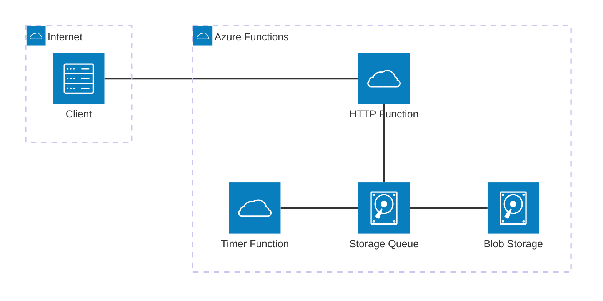
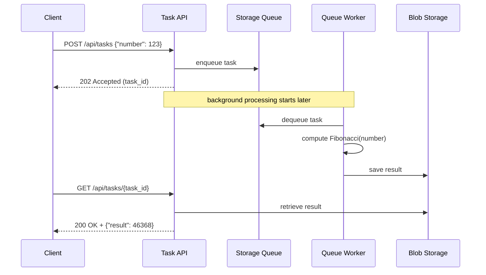

# A minimal but complete implementation of the Asynchronous Request-Reply pattern using Azure Functions, Storage Queue, and Blob Storage (fully local via Azurite).

### Inspired by

https://github.com/mspnp/cloud-design-patterns/tree/main/async-request-reply#asynchronous-request-reply-pattern

## Setting
* Azure functions
* Azurite
* Python

> Make sure you have compatible Python version with Azure Functions

## Preparation
Create folders and virtual environemtn for python. Install all necessary modules from requirements.txt

### Initialize functions
```sh
func init . --worked-runtime python
```
### Start Azurite
```sh
azurite --location ./azurite-storage
```

## Architecture


## Sequence diagram


## Structure

function.app
```python
import logging
import azure.functions as func
from create_task import main as create_task_main
from queue_worker import main as queue_worker_main
from storage_checker import main as storage_checker_main


app = func.FunctionApp(http_auth_level=func.AuthLevel.ANONYMOUS)


@app.schedule(schedule="0 */1 * * * *", arg_name="mytimer", run_on_startup=True, use_monitor=False)
def timer_function(mytimer: func.TimerRequest) -> None:
    logging.info(f"Timer: calling function queue_worker_main")
    queue_worker_main()


@app.route(route="tasks", methods=["POST"])
def create_task_route(req: func.HttpRequest) -> func.HttpResponse:
    return create_task_main(req)


@app.route(route="tasks/{task_id}", methods=["GET"])
def get_task_status(req: func.HttpRequest) -> func.HttpResponse:
    return storage_checker_main(req)
```
create_task.py
```python
import uuid
import json
import logging
import os
import azure.functions as func
from azure.storage.queue import QueueClient

queue_client = QueueClient.from_connection_string(
    conn_str=os.environ["AzureWebJobsStorage"],
    queue_name=os.getenv("queue_name")
)


def main(req: func.HttpRequest) -> func.HttpResponse:
    data = req.get_json()
    number = data.get("number")  
    id = str(uuid.uuid4())

    logging.info(f"id: {id}, number: {number}")

    message_text = json.dumps({
        "id"    :id,
        "number":number
    })
    queue_client.send_message(message_text)

    return func.HttpResponse(
        message_text,
        mimetype="application/json",
        status_code=202
    )
```

queue_worker.py
```python
import os
import json, ast
import base64
import logging
import azure.functions as func
from azure.storage.queue import QueueClient
from azure.storage.blob import BlobServiceClient
from sympy import fibonacci


conn_str        = os.getenv("AzureWebJobsStorage")
container_name  = os.getenv("BLOB_CONTAINER_NAME", "hello-container")
queue_name      = os.getenv("queue_name")

blob_service_client = BlobServiceClient.from_connection_string(conn_str)
container_client = blob_service_client.get_container_client(container_name)

queue_client = QueueClient.from_connection_string(
    conn_str=conn_str,
    queue_name=queue_name
)

def main():
    messages = queue_client.receive_messages(messages_per_page=10)

    for msg_batch in messages.by_page():
        for msg in msg_batch:
            
            msg_content = msg.get("content")
            msg_content = ast.literal_eval(msg_content.strip())
            logging.info(f"msg_content: {msg_content}")

            task_id = msg_content.get("id")
            number = msg_content.get("number")
            logging.info(f"MESSAGE INFO: id:{task_id}, number:{number}")
            
            # here we do some simple business logic.
            # for our case it's a fibonacci calculation
            calculation_result = str(fibonacci(number))
            #
            #

            calculation_result = {
                "number"                : number,
                "calculation_result"    : calculation_result
            }

            logging.info(f"MESSAGE INFO: id:{task_id}, number:{number}, fibonacci_result: {calculation_result}")

            blob_name = str(task_id)
            blob_client = container_client.get_blob_client(blob_name)
            blob_client.upload_blob(json.dumps(calculation_result), overwrite=True)
            
            # Delete the message in the queue
            queue_client.delete_message(msg)
            logging.info(f"MESSAGE INFO: Deleted. id: {msg.id}, number:{number}, calculation_result: {calculation_result}")
       
    return json.dumps({
        "status": True
    })
```

storage-checker.py
```python
import os
import json
import base64
import logging
import azure.functions as func
from azure.storage.blob import BlobServiceClient


connection_string = os.getenv("AzureWebJobsStorage")
container_name = os.getenv("BLOB_CONTAINER_NAME", "hello-container")


blob_service_client = BlobServiceClient.from_connection_string(connection_string)
container_client = blob_service_client.get_container_client(container_name)

def main(req: func.HttpRequest) -> func.HttpResponse:
    response = {}
    data = ""
    task_id = req.route_params.get("task_id")

    blob_name = str(task_id)
    blob_client = container_client.get_blob_client(blob_name)
    if blob_client.exists():
        data = blob_client.download_blob().readall().decode("utf-8")
        logging.info(f"Data:{data}")

        data = json.loads(data)

        # delete blob
        blob_client.delete_blob()
        logging.info(f"Blob {blob_name} deleted")

        status_code = 200
    else:
        status_code = 404

    logging.info(data)

    response["task_id"] = task_id
    response.update(data)

    return func.HttpResponse(
        json.dumps(response),
        mimetype="application/json",
        status_code=status_code
    )
```

requirements.txt
```
azure-functions
azure-storage-queue
azure-storage-blob
sympy
```

local.settings.json
```json
{
  "IsEncrypted": false,
  "Values": {
    "FUNCTIONS_WORKER_RUNTIME": "python",
    "AzureWebJobsStorage": "DefaultEndpointsProtocol=http;AccountName=devstoreaccount1;AccountKey=Eby8vdM02xNOcqFlqUwJPLlmEtlCDXJ1OUzFT50uSRZ6IFsuFq2UVErCz4I6tq/K1SZFPTOtr/KBHBeksoGMGw==;BlobEndpoint=http://127.0.0.1:10000/devstoreaccount1;QueueEndpoint=http://127.0.0.1:10001/devstoreaccount1;",
    "BLOB_CONTAINER_NAME": "hello-container",
    "queue_name": "background-tasks"
  }
}
```

