# Simple 10-Minute Example of BFF: Backend for Frontend in Azure

## Inspired by
[Azure Architecture Pattern — Backends for Frontends](https://learn.microsoft.com/en-us/azure/architecture/patterns/backends-for-frontends)

## Stack
- Azure Functions  
- Python  

---

## Architecture

```mermaid
---
config:
  theme: base
  themeVariables:
    primaryColor: "#0078D4"       # Azure blue
    primaryTextColor: white
    primaryBorderColor: "#0078D4"
    secondaryColor: "#63ADE5"
    lineColor: "#666"
    clusterBkg: "#ffffff"
    clusterBorder: "#888"
---
flowchart LR

subgraph INTERNET["☁️ Internet"]
    PC(["💻 Client"])
    MB(["📱 Mobile"])
    I(["🔧 IoT Device"])
end

subgraph AZURE["☁️ Azure Functions"]
    API(["⚙️ API Handler"])
    BFF(["🌀 BFF Adapter"])
end

subgraph BACKEND["🗄️ Backend"]
    B(["🗄️ Data Service"])
end

PC & MB & I --> API --> BFF --> B
```


## Sequence diagram

```mermaid
---
config:
  theme: base
  themeVariables:
    primaryColor: "#5BB5D9"
    secondaryColor: "#B0CDD9"
    actorTextColor: "#00334d"
    noteTextColor: "#00334d"
    lineColor: "#00334d"
    noteBkgColor: "#D0E9F2"
    noteBorderColor: "#D0E9F2"

---
sequenceDiagram
    autonumber

    participant Client as 💻 Client<br/>(Laptop / Mobile / IoT)
    participant BFF as ⚡ BFF<br/>(Azure Function)
    participant Backend as 🗄️ Backend<br/>(Data service)

    Client->>+BFF: GET /api/temperature
    BFF->>+Backend: Fetch temperature data
    Backend-->>-BFF: JSON { one for all }
    BFF-->>-Client: Format and return per client type

    Note over BFF,Client: BFF tailors response for UI needs
    
```


## Functions
> A single Azure Function implementing a minimal BFF pattern.
The same endpoint serves multiple client types with tailored responses.

function-app.py
```python
import azure.functions as func
import datetime
import json
import logging
import urllib.request

# Clients
DESKTOP_DEVICE = ("mozilla", "curl")
MOBILE_DEVICE  = ("android", "iphone")

app = func.FunctionApp(http_auth_level=func.AuthLevel.ANONYMOUS)


def device_identification(user_agent: str) -> str:
    """Identify device category based on the User-Agent."""
    if any(agent in user_agent for agent in DESKTOP_DEVICE):
        return "desktop"
    if any(agent in user_agent for agent in MOBILE_DEVICE):
        return "mobile"
    return "iot"


def request_backend() -> dict | bool:
    """Fetch data from backend API."""
    backend_url = (
        "https://api.open-meteo.com/v1/forecast"
        "?latitude=52.52&longitude=13.41&current_weather=true"
    )
    try:
        with urllib.request.urlopen(backend_url, timeout=5) as resp:
            return json.load(resp)
    except Exception as e:
        logging.error(f"Backend fetch failed: {e}")
        return False


@app.route(route="temperature")
def temperature(req: func.HttpRequest) -> func.HttpResponse:
    """BFF endpoint — adapts backend data per client type."""

    user_agent = req.headers.get("User-Agent", "").lower()
    device = device_identification(user_agent)
    backend_data = request_backend()
    if backend_data is False:
        return func.HttpResponse(
            json.dumps({"error": "Backend unavailable"}),
            headers={"Content-Type": "application/json"},
            status_code=502
        )

    weather = backend_data.get("current_weather", {})
    temp = weather.get("temperature", 0.0)
    wind = weather.get("windspeed", 0.0)
    ts = weather.get(
        "time",
        datetime.datetime.now(datetime.timezone.utc).isoformat()
    )

    # ---------------- BFF Logic ----------------
    if device in ("desktop", "mobile"):
        payload = {
            "timestamp": ts,
            "temperature": temp,
            "unit": "C",
            "wind": f"{wind} km/h",
            "meta": {
                "source": "open-meteo.com",
                "city": "Berlin",
                "device": device,
            },
        }
    else:  # IoT: compact format
        payload = {"t": round(temp, 1), "u": "C", "ts": ts}

    logging.info(f"BFF[{device}] → {payload}")

    return func.HttpResponse(
        json.dumps(payload),
        headers={"Content-Type": "application/json"},
        status_code=200,
    )

```

## Result
Test locally
```sh
curl -A "Mozilla" http://localhost:7071/api/temperature
{"timestamp": "2025-11-10T07:45", "temperature": 7.9, "unit": "C", "wind": "5.2 km/h", "meta": {"source": "open-meteo.com", "city": "Berlin", "device": "desktop"}}

curl -A "Android" http://localhost:7071/api/temperature
{"timestamp": "2025-11-10T07:45", "temperature": 7.9, "unit": "C", "wind": "5.2 km/h", "meta": {"source": "open-meteo.com", "city": "Berlin", "device": "mobile"}}

curl -A "EPS32" http://localhost:7071/api/temperature
{"t": 7.9, "u": "C", "ts": "2025-11-10T07:45"}
```
