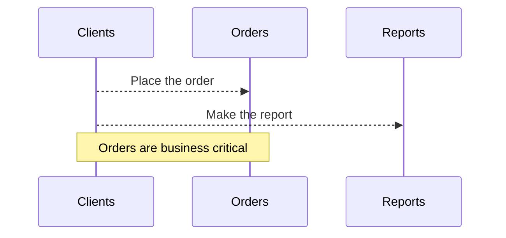
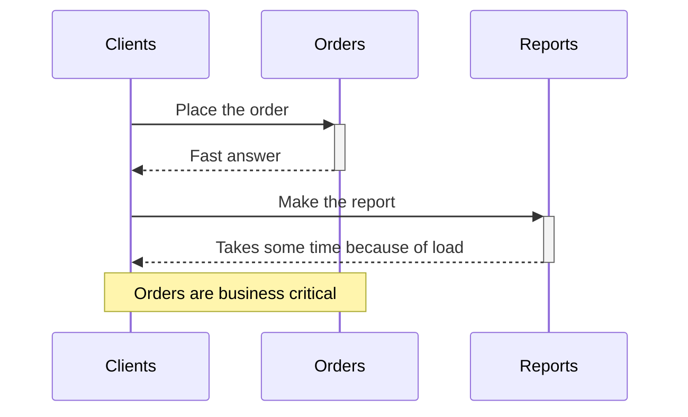

# Bulkhead Pattern with Azure Functions, Docker & Jenkins
*Practical isolation of business-critical workloads under resource pressure.*

## Stack
* Azure Functions (Python)
* Docker (per-function containerization)
* Jenkins (CI/CD)
* GitHub (source control)

## Baseline: Single Application = Shared Failure Domain
Initially both operations lived inside one Azure Function App:

- /orders — business-critical
- /reports — slow, CPU-intensive

Single process = shared CPU/memory/runtime.
One endpoint saturating the runtime leads to both degrade.

**Sequence**


**function-app.py**
```python
import azure.functions as func
import datetime
import json
import logging


app = func.FunctionApp(http_auth_level=func.AuthLevel.ANONYMOUS)

@app.route(route="orders")
def orders(req: func.HttpRequest) -> func.HttpResponse:
    return func.HttpResponse(
        json.dumps({
            "message":"order received"
        })
    )

@app.route(route="reports")
def reports(req: func.HttpRequest) -> func.HttpResponse:
    return func.HttpResponse(
        json.dumps({
            "message": "report is done"
        })
    )
```

# Testing
**Quick test (before load)**

```sh
time curl http://localhost/api/orders
{"message": "order received"}
real    0m0.329s
user    0m0.008s
sys     0m0.010s
```

**Load on /reports**
```sh
seq 1 100000 | xargs -n1 -P30 -I{} curl -s "http://192.168.0.107/api/reports" > /dev/null
```

**Re-test /orders**
```sh
time curl http://localhost/api/orders
{"message": "order received"}
real    0m11.236s
user    0m0.018s
sys     0m0.004s
```

### Conclusion

Shared runtime = shared pain. A critical path must not depend on the stability or performance of non-critical workloads.

## Applying the Bulkhead Pattern

Bulkhead means running independent workloads on isolated resources, so degradation in one “compartment” cannot propagate.

**For this demo:**

- Split into two Function Apps
- Package each as an isolated Docker container
- Apply strict CPU & memory limits
- Add health checks + autonomous restart
- Run in parallel via Jenkins

**Sequence**



### Orders Function App (isolated)

**function-app.py**
```python
import azure.functions as func
import datetime
import json
import logging


app = func.FunctionApp(http_auth_level=func.AuthLevel.ANONYMOUS)

@app.route(route="orders")
def orders(req: func.HttpRequest) -> func.HttpResponse:
    return func.HttpResponse(
        json.dumps({
            "message":"order received"
        })
    )
```

**Dockerfile**
```Dockerfile
FROM mcr.microsoft.com/azure-functions/python:4-python3.11

# Define workdir
WORKDIR /home/site/wwwroot

# Copy application code
COPY ./app /home/site/wwwroot

# Install dependencies from requirements.txt
RUN if [ -f /home/site/wwwroot/requirements.txt ]; then \
    pip install -r /home/site/wwwroot/requirements.txt; \
    fi
```

### Reports Function App (isolated)
**function-app.py**
```python
import azure.functions as func
import datetime
import json
import logging


app = func.FunctionApp(http_auth_level=func.AuthLevel.ANONYMOUS)

@app.route(route="reports")
def reports(req: func.HttpRequest) -> func.HttpResponse:
    return func.HttpResponse(
        json.dumps({
            "message": "report is done"
        })
    )
```

**Dockerfile identical to Orders.**

### Jenkins Pipeline — Parallel, Isolated Containers
Each service becomes a **separate image** and a **separate resource pool**.

```groovy
pipeline{
    agent any

    environment{
        PORT_ORDERS     = 8081
        PORT_REPORTS    = 8082
        CPU_LIMIT       ='0.05' // Intentionally low to demonstrate slow containers
        RAM_LIMIT       ='256m'
    }

    triggers {
        pollSCM("* * * * *")
    }
    stages {
        stage('Checkout'){
            steps{
                checkout scm
            }
        }
        stage('Build docker images'){
            steps{
                script{
                    // build orders
                    sh "docker build -t orders-image ./orders"

                    // build reports
                    sh "docker build -t reports-image ./reports"
                }
            }
        }
        
        stage('Run Azure Functions containers'){
            parallel{

                stage('Run orders'){
                    agent any
                    steps{
                        script{
                            sh """
                                docker rm -f orders || true
                                docker run -d \
                                    --name orders \
                                    -p ${PORT_ORDERS}:80 \
                                    --cpus=${CPU_LIMIT} \
                                    --memory=${RAM_LIMIT} \
                                    --memory-swap=${RAM_LIMIT} \
                                    --restart=always \
                                    --health-cmd="curl -f http://localhost:80/api/orders || exit 1" \
                                    --health-interval=10s \
                                    --health-retries=3 \
                                    orders-image
                            """
                        }                        
                    }
                }


                stage('Run reports'){
                    agent any
                    steps{
                        script{
                            sh """
                                docker rm -f reports || true
                                docker run -d \
                                    --name reports \
                                    -p ${PORT_REPORTS}:80 \
                                    --cpus=${CPU_LIMIT} \
                                    --memory=${RAM_LIMIT} \
                                    --memory-swap=${RAM_LIMIT} \
                                    --restart=always \
                                    --health-cmd="curl -f http://localhost:80/api/reports || exit 1" \
                                    --health-interval=10s \
                                    --health-retries=3 \
                                    reports-image
                            """
                        }                        
                    }
                }
            }
        }
    }
}
```
This is the **actual bulkhead:**

-independent runtimes
- independent images
- independent CPU/memory budgets
- independent crash-recovery
- health-driven self-healing

**Zero shared failure domain.**

## Bulkhead Test

**Load the non-critical service:**
```sh
seq 1 100000 | xargs -n1 -P30 -I{} curl -s "http://192.168.0.107:8082/api/reports"
```

**Benchmark /orders under pressure:**
```sh
time curl http://localhost:8081/api/orders
{"message": "order received"}
real    0m0.028s
user    0m0.009s
sys     0m0.009s

time curl http://localhost:8081/api/orders
{"message": "order received"}
real    0m0.442s
user    0m0.004s
sys     0m0.013s

time curl http://localhost:8081/api/orders
{"message": "order received"}
real    0m0.954s
user    0m0.015s
sys     0m0.006s
```
Always `<1s`, despite hostile load on the other container.

**Benchmark /reports:**
```sh
time curl http://localhost:8082/api/reports
{"message": "report is done"}
real    0m10.190s
user    0m0.013s
sys     0m0.009s
```
**~10 seconds (expected under CPU throttling)**

## Result

**orders** (`a critical business process`) remains responsive even while reports is overloaded.
That is the intended behavior of the Bulkhead pattern:

- failure containment
- resource isolation
- predictable performance for critical paths

This implementation is intentionally `simple`, but the architectural principle mirrors what’s done in production systems:
separate pods, separate autoscaling groups, dedicated queues, or dedicated compute pools.
