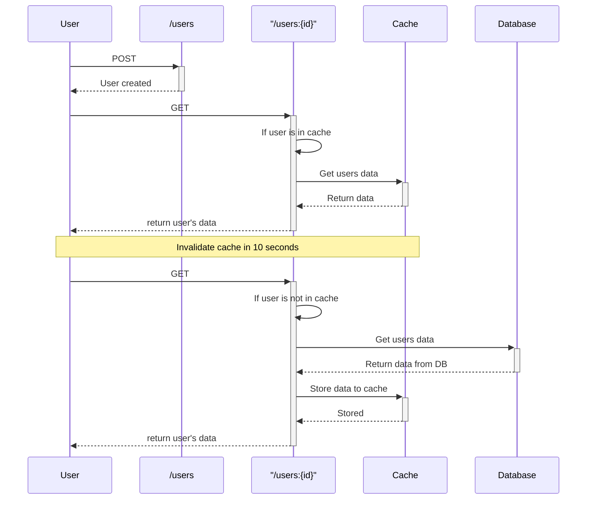

# Cache-Aside Pattern

## Overview

A compact demo of the Cache-Aside Pattern: the application controls reads/writes to the cache and the backing store. The first read loads data from the database; subsequent reads hit the cache, reducing DB load and improving latency.

Performance (example):
- First request (DB): ~50 ms
- Subsequent requests (cache): ~23 ms — roughly 2x faster

## Key technologies

- Python (Azure Functions)
- Azure Table Storage (Azurite for local dev)
- Redis for in-memory caching
- k3s, Docker, ArgoCD, Kustomize for deployment

## Benefits

- Reduced database load  
- Faster responses on cache hits  
- Simple, flexible implementation  
- Cache expiration to control staleness

## Sequence diagram


## App

### Prepare environment (Windows / Linux notes)
Example (Windows-ish paths shown; adapt for Linux/macOS):

```bash
mkdir -p cache-aside/app && cd cache-aside
python -m venv .env && source .env/bin/activate   # on Windows: .env\Scripts\activate
cd app
pip install -U pip
pip install -r requirements.txt
func init . --worker-runtime python
```

requirements.txt (used for the lab)
```
async-timeout==5.0.1
azure-core==1.36.0
azure-data-tables==12.7.0
azure-functions==1.24.0
certifi==2025.11.12
charset-normalizer==3.4.4
idna==3.11
isodate==0.7.2
MarkupSafe==3.0.3
multidict==6.7.0
names==0.3.0        # only for demo data in the lab
propcache==0.4.1
redis==7.1.0
requests==2.32.5
typing_extensions==4.15.0
ulid-py==1.1.0
urllib3==2.5.0
Werkzeug==3.1.3
yarl==1.22.0
```

Notes: `names` is used only to generate demo data.

### Example function_app.py (simplified)
- IPs and credentials are hard-coded here for demo convenience — avoid this in production.
- The lab uses Azurite, but a real storage account is interchangeable. Keys and names will differ in real deployments.

Key behavior:
- POST /api/users creates a user record in the table (simulator).
- GET /api/users/{id} first checks Redis; on miss it reads the table, caches the result (with expiration) and returns the data.

```python
import azure.functions as func
import logging
import json
import names
import ulid
from azure.data.tables import TableServiceClient
from azure.core.exceptions import ResourceNotFoundError
from redis import Redis

redis_hostname = "redis.local"
azurite_hostname = "azurite.local"

connection_string = (
    "DefaultEndpointsProtocol=http;"
    "AccountName=devstoreaccount1;"
    "AccountKey=Eby8vdM02xNOcqFlqUwJPLlmEtlCDXJ1OUzFT50uSRZ6IFsuFq2UVErCz4I6tq/K1SZFPTOtr/KBHBeksoGMGw==;"
    f"TableEndpoint=http://{azurite_hostname}:10002/devstoreaccount1;"
)

service = TableServiceClient.from_connection_string(conn_str=connection_string)
table_name = "users"

# Create table for the lab if needed
try:
    service.create_table(table_name)
except Exception as ex:
    logging.warning(f"Table {table_name} creation failed or already exists: {ex}")

table_client = service.get_table_client(table_name)

# Setup redis
cache = Redis(host=redis_hostname, port=6379, decode_responses=True)
app = func.FunctionApp(http_auth_level=func.AuthLevel.ANONYMOUS)

@app.route("users", methods=["POST"])
def create_user(req: func.HttpRequest) -> func.HttpResponse:
    uid = ulid.new()
    person = names.get_full_name()
    entity = {
        "PartitionKey": "user",
        "RowKey": uid.str,
        "Name": person
    }
    table_client.create_entity(entity)
    return func.HttpResponse(
        json.dumps(entity),
        status_code=201,
        headers={
            "Content-Type": "application/json",
            "Location": f"/users/{entity['RowKey']}"
        }
    )

@app.route(route="users/{id}")
def get_user(req: func.HttpRequest) -> func.HttpResponse:
    user_id = req.route_params.get("id")
    key = f"user:{user_id}"

    cached = cache.get(key)
    if cached:
        logging.info("Cache hit")
        return func.HttpResponse(json.dumps({
            "source": "redis",
            "data": cached
        }))

    logging.info("Cache miss")
    try:
        entity = table_client.get_entity(partition_key="user", row_key=user_id)
    except ResourceNotFoundError:
        return func.HttpResponse(json.dumps({
            "user_id": user_id,
            "status": "Not found"
        }), status_code=404)

    data = {
        "id": entity["RowKey"],
        "name": entity["Name"],
        "PartitionKey": entity["PartitionKey"]
    }

    # cache for 10 seconds (demo)
    cache.set(key, str(data), ex=10)

    return func.HttpResponse(json.dumps({
        "source": "table",
        "data": entity
    }))
```

## Test (example)

The timing difference is visible:

First call (DB hit) ~0.05s
```
time curl -v http://cache-aside.local/api/users/01KB584F3Y9AF31621Q7N62Q67
> GET /api/users/01KB584F3Y9AF31621Q7N62Q67 HTTP/1.1
< HTTP/1.1 200 OK
{"source": "table", "data": {"PartitionKey": "user", "RowKey": "01KB584F3Y9AF31621Q7N62Q67", "Name": "Angelica Hill"}}
real    0m0.046s
```

Second call (cache hit) ~0.02s
```
time curl -v http://cache-aside.local/api/users/01KB584F3Y9AF31621Q7N62Q67
> GET /api/users/01KB584F3Y9AF31621Q7N62Q67 HTTP/1.1
< HTTP/1.1 200 OK
{"source": "redis", "data": "{'id': '01KB584F3Y9AF31621Q7N62Q67', 'name': 'Angelica Hill', 'PartitionKey': 'user'}"}
real    0m0.023s
```

## Closing notes

This is a minimal, reproducible demo intended for a portfolio post. For production: avoid hard-coded IPs/keys, add observability, reliable cache invalidation, and robust error handling.
